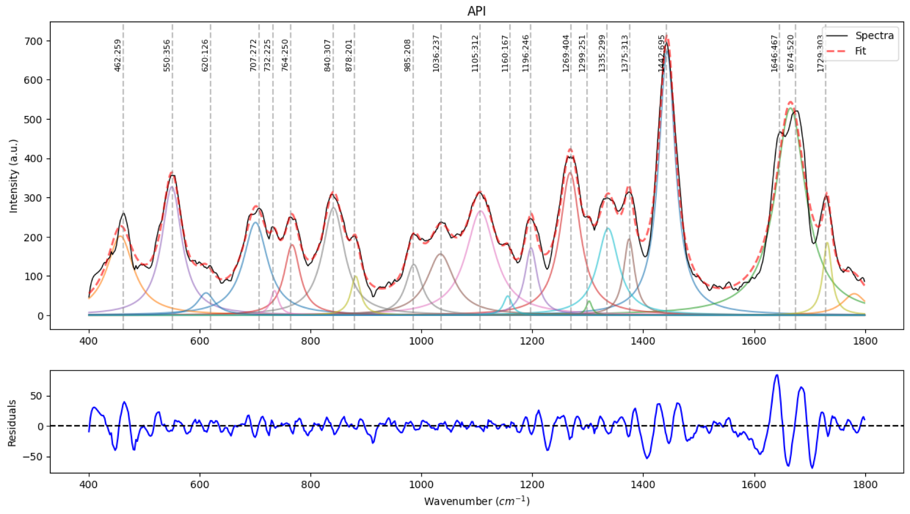
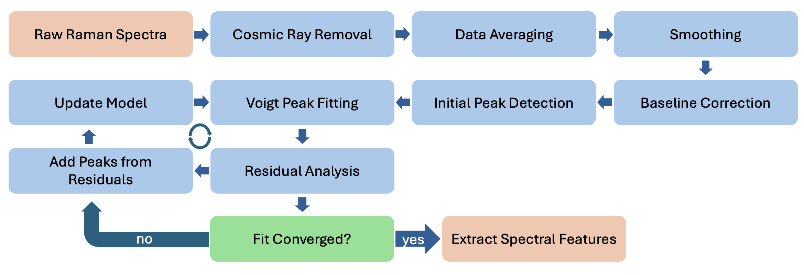

# RamanAnalyzer — Modular, Automated Raman Spectral Analysis (Python)



**Author:** Mykyta Kizilov  
**Affiliation:** Advanced Spectroscopy Laboratory, Texas A&M University  
**Repository:** `https://github.com/mkizilov/RamanAnalyzer`  

> A lightweight, modular toolkit for Raman spectra preprocessing and Voigt peak analysis. Includes CSV parsing, wavelength→wavenumber conversion, despiking, baseline correction (ALS & IarPLS), spectrum averaging, and iterative Voigt fitting with residual-driven refinement.



---

## Features

- **I/O**: Multi-trace CSV parser → list of `DataFrame`s (`Wavenumber`, `Intensity`)
- **Coordinate tools**: Wavelength→Raman shift conversion (cm⁻¹)
- **Utilities**: Averaging with interpolation to a common axis; range cutting
- **Artifact removal**: Cosmic-ray **despiking** (modified Z-score)
- **Baseline**: **ALS** and **IarPLS** background estimation
- **Peak modeling**: Iterative **Voigt** fitting (`lmfit`) with residual peak discovery & model pruning
- **Plotting**: Quick visualization helpers for spectra, baselines, fits & residuals

---

## Installation

```bash
# Python 3.9+ recommended
pip install numpy scipy pandas lmfit matplotlib
```

> Dependencies used in this repo: `numpy`, `scipy`, `pandas`, `lmfit`, `matplotlib`.

---

## Quickstart

### 1) Load & average spectra
```python
import pandas as pd
from raman_analyzer import (
    raman_parser, average_raman, cut_spectra, plot_raman
)

dfs = raman_parser("data/example.csv")        # CSV: first col = wavelength or wavenumber, subsequent cols = intensities
spec = average_raman(dfs, plot=True)          # Interpolate to common grid and average
spec = cut_spectra(spec, start=200, end=2000) # Optional region of interest
plot_raman(spec, "Averaged Spectrum")
```

### 2) (If your CSV uses wavelength) convert to Raman shift
```python
from raman_analyzer import convert_wavelength_to_wavenumber
spec = convert_wavelength_to_wavenumber(spec, excitation_wavelength_nm=532.0)
```

### 3) Despike + baseline
```python
from raman_analyzer import despike_raman, estimate_baseline, estimate_baseline_iarpls

spec = despike_raman(spec, moving_average=8, threshold=7, plot=True)     # cosmic ray suppression
spec = estimate_baseline(spec, lam=1e7, p=0.05, niter=3, plot=True)      # ALS baseline (fast & robust)
# Or try the adaptive IarPLS variant:
# spec = estimate_baseline_iarpls(spec, lam=1e7, niter=50, epsilon=1e-6, plot=True)
```

### 4) Iterative Voigt fitting
```python
from raman_analyzer import fit_voigts

result = fit_voigts(
    spec,
    title="Sample — Voigt Fit",
    threshold=0.25,      # residual peak detection threshold
    min_dist=2,          # min peak distance (in samples)
    min_height=2,        # remove negligible peaks
    max_iterations=5,
    center_vary=5,       # center bounds (± cm⁻¹)
    plot=True,           # plots fit & residuals each iteration
    verbose=True
)

# Access fitted parameters (lmfit ModelResult)
print(result.fit_report())
params = result.params
```

---

## Expected CSV format

- First row: units/header line (skipped by parser)
- First column: **Wavenumber** *or* **Wavelength**
- Remaining columns: **Intensity** traces (one column per spectrum)

Example (snippet):
```text
units, trace_1, trace_2, ...
Wavenumber(or Wavelength), I1, I2, ...
...
```

---

## API (selected)

- `raman_parser(file_path) → list[pd.DataFrame]`  
  Read multi-trace CSV into DataFrames with (`Wavenumber`, `Intensity`).

- `calculate_wavenumber_from_wavelength(ex_nm, λ_nm) → ν_cm⁻¹`  
  Single-point conversion.

- `convert_wavelength_to_wavenumber(df, ex_nm) → df`  
  Column-wise wavelength→Raman shift conversion.

- `average_raman(dfs, resolution=None, plot=False) → df`  
  Interpolate to common axis & average multiple spectra.

- `cut_spectra(df, start=None, end=None) → df`  
  Range selection by Raman shift.

- `despike_raman(df, moving_average, threshold=7, plot=False) → df`  
  Modified Z-score despiking on first differences.

- `estimate_baseline(df, lam=1e7, p=0.05, niter=3, plot=False) → df`  
  Asymmetric Least Squares (ALS) baseline removal.

- `estimate_baseline_iarpls(df, lam=1e7, niter=50, epsilon=1e-6, plot=False) → df`  
  IarPLS baseline (iterative, adaptive weights).

- `fit_voigts(df, ..., plot=False, max_iterations=5, ...) → lmfit.ModelResult`  
  Peak detect → composite Voigt fit → residual peak add-in → prune weak peaks → repeat.

- `plot_raman(df, title_prefix="Intensity Plot")`  
  Simple line plot of `Wavenumber` vs `Intensity`.

---

## Citing

If you use this software in academic work, please cite:

> **Kizilov M.**, Cheburkanov V., Harrington J., Yakovlev V. V.  
> *Modular and Automated Workflow for Streamlined Raman Signal Analysis* (manuscript).  
> Keywords: Raman spectroscopy, automated preprocessing, Voigt peak fitting, baseline correction, noise suppression.

**BibTeX**
```bibtex
@article{KizilovRamanAnalyzer,
  title   = {Modular and Automated Workflow for Streamlined Raman Signal Analysis},
  author  = {Kizilov, Mykyta and Cheburkanov, Vsevolod and Harrington, Joseph and Yakovlev, Vladislav V.},
  journal = {Journal of Raman Spectroscopy},
  year    = {2025}
}
```

---

## Contributing
Contributions are welcome.

---

## License

See [`LICENSE`](./LICENSE).
